# AI-Based Autonomous Self-Parking Car System

This project is an AI and IoT-based autonomous self-parking car prototype developed as a computing research project. The system uses a Raspberry Pi, camera-based parking space detection, ultrasonic sensors, and Python-based motor control logic to detect free or occupied parking spaces and support an automated parking sequence.

## Project Overview

The aim of this project was to design and develop a small-scale autonomous car parking system. The prototype identifies available parking spaces using camera detection, checks surrounding distance using ultrasonic sensors, and controls car movement through Raspberry Pi GPIO and motor driver logic.

The system was tested in a designed parking environment using a prototype car and toy vehicles as obstacles. This project demonstrates practical experience in AI, IoT, embedded systems, sensor integration, real-world testing, and Python programming.

## Key Features

- Camera-based parking space detection
- Free and occupied parking space classification
- Ultrasonic sensor distance measurement
- GPIO-based motor control
- Automated parking movement sequence
- Real-world prototype testing using a designed parking area
- Source code and testing images included

## Technologies Used

- Python
- Raspberry Pi
- TensorFlow Lite
- OpenCV
- GPIO
- Ultrasonic Sensors
- Camera Module
- DC Motor Driver

## Prototype

The prototype car was built using a Raspberry Pi, camera module, ultrasonic sensors, motor driver, and a small robot car chassis.

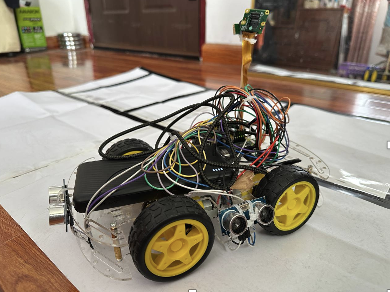

## Parking Test Environment

The testing environment was designed using marked parking spaces and obstacle vehicles to simulate a car parking scenario.

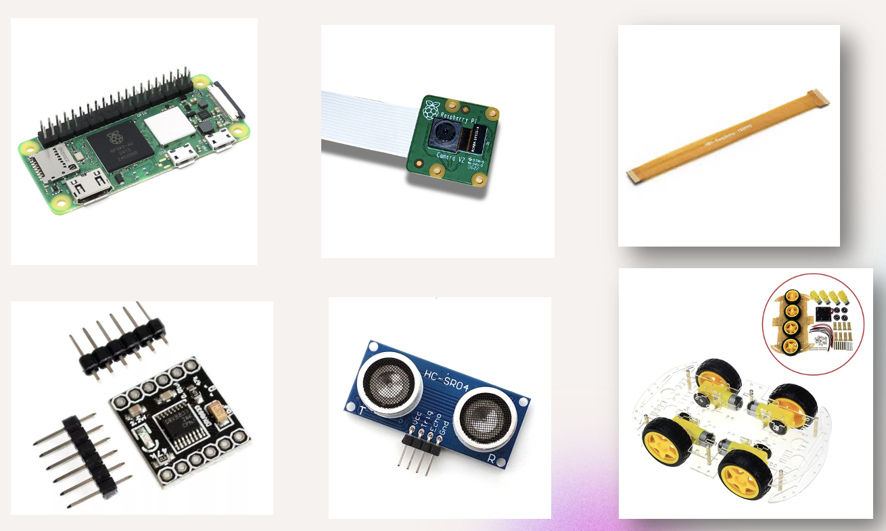

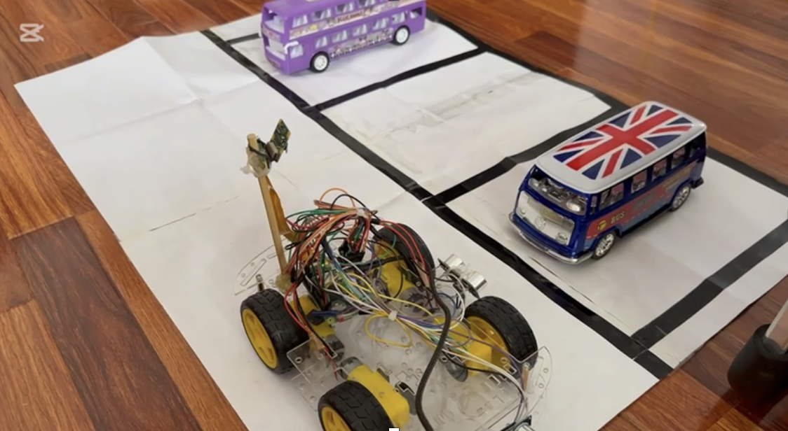

## Parking Process

The autonomous car tested parking movement by checking available space, detecting obstacles, and moving into the parking area.

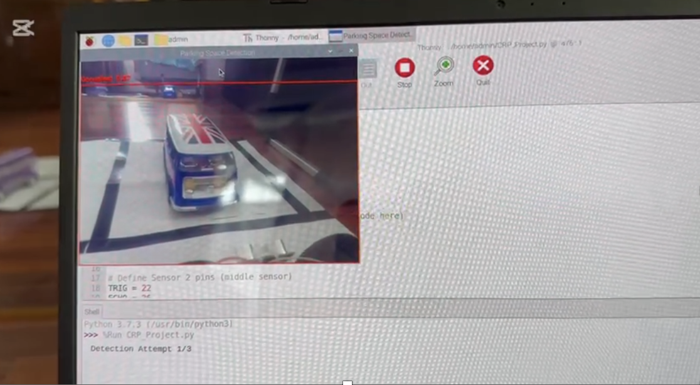

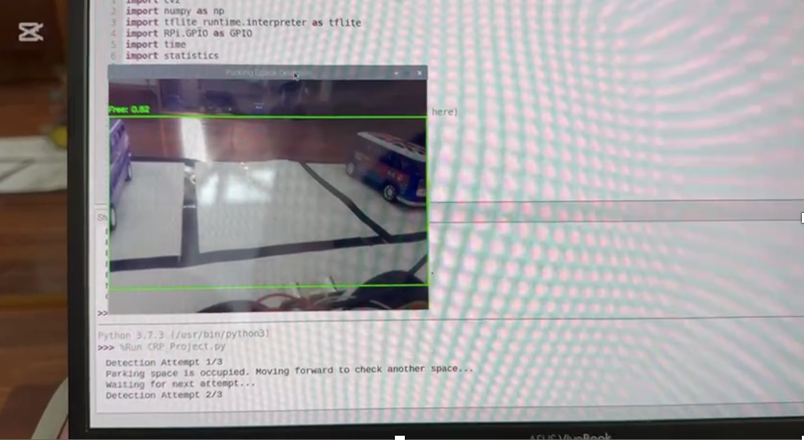

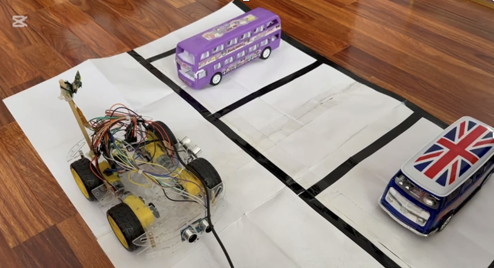

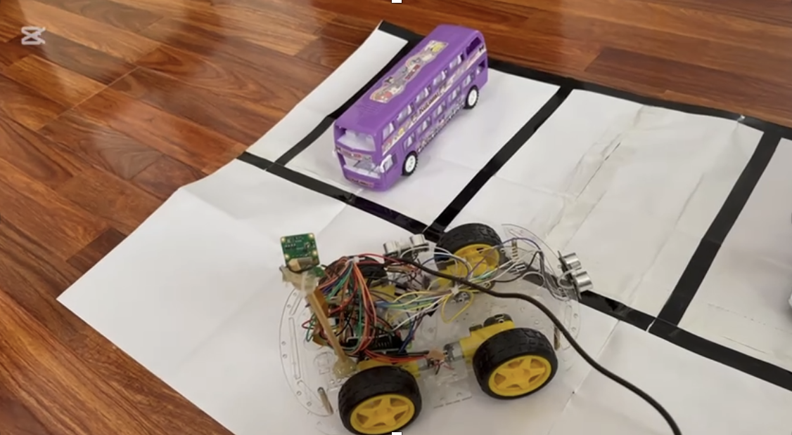

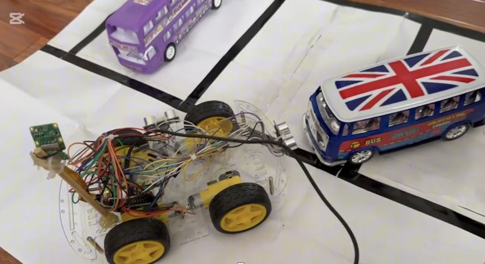

## Detection and Testing Evidence

The system used camera-based detection to identify whether a parking space was free or occupied. Terminal output and the camera detection window were used to confirm the detection process and parking decision.

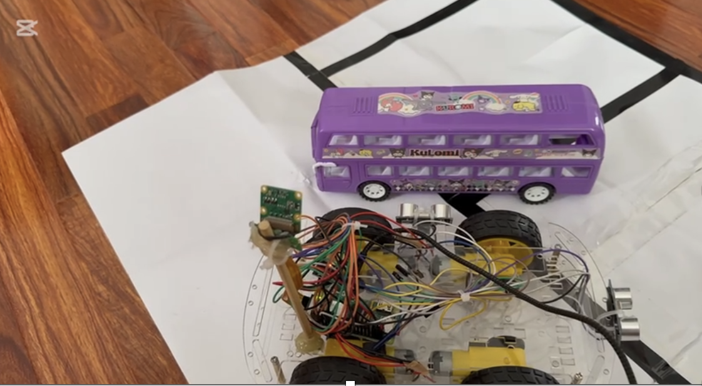

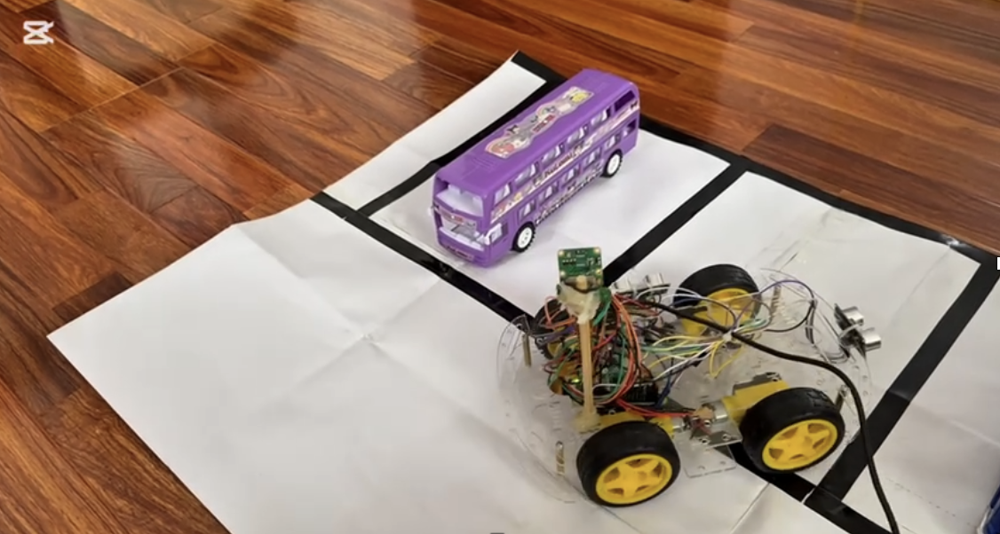

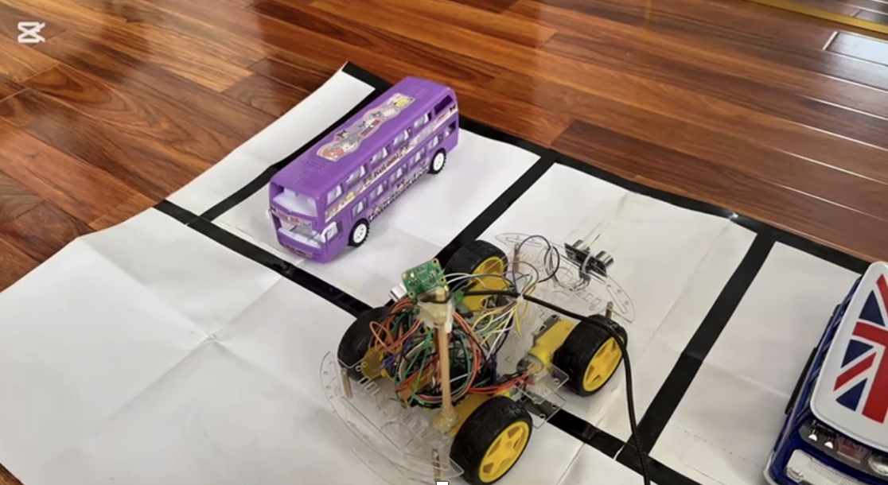

## Additional Testing Evidence

The prototype was tested in different parking scenarios, including free parking spaces, occupied spaces, and obstacle positions. Ultrasonic sensor readings were used to support distance measurement and parking alignment.

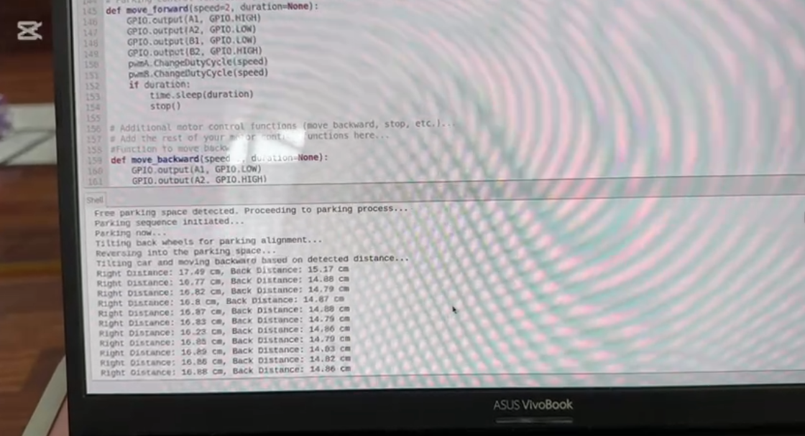

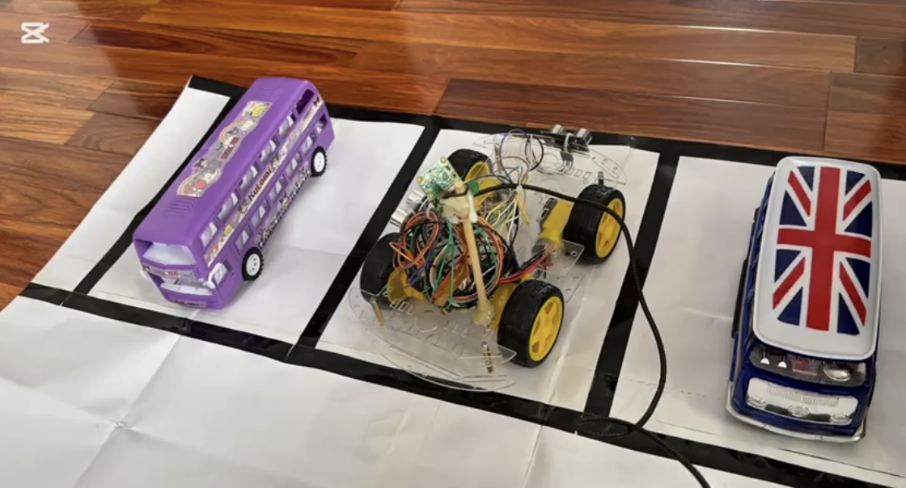

## What I Learned

Through this project, I gained practical experience in AI model deployment, Raspberry Pi hardware integration, ultrasonic sensor measurement, motor control, and camera-based detection. I also improved my ability to test a real prototype, debug hardware and software issues, and evaluate system performance.

## Project Status

Completed as a computing research project.

## Future Improvements

- Improve parking accuracy with better motor calibration
- Use a larger and more balanced dataset for detection
- Improve object detection in different lighting conditions
- Make the wiring and prototype structure cleaner
- Add a dashboard or mobile interface to monitor parking status
